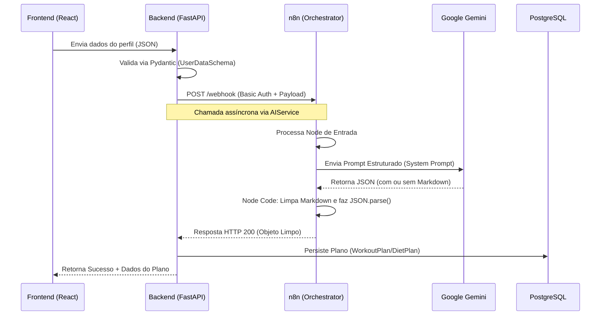

# 🏗️ Arquitetura de Fluxo de Dados - MarombAI

Este documento descreve como a inteligência do MarombAI é processada, detalhando a jornada do dado desde o formulário do usuário até o plano de treino/dieta final.

## 1. Visão Geral da Pilha Tecnológica

- **Backend (FastAPI):** Atua como o "porteiro" e validador. Garante que os dados estão corretos antes de processar.
- **n8n (Orchestrator):** Atua como o "maestro". Ele conhece o caminho para a IA e sabe como limpar a resposta dela.
- **Gemini 1.5 (LLM):** Atua como o "especialista". Recebe o perfil e gera o conhecimento técnico (exercícios/alimentos).

## 2. Diagrama de Sequência

## 3. Detalhamento das Camadas

### A. Camada de Validação (Backend)

O `AIService` no backend não envia dados crus. Ele utiliza o `model_dump(mode='json')` dos modelos Pydantic. Isso garante que:

- Datas sejam convertidas para strings ISO.
- Números sejam validados (ex: peso > 0).
- A estrutura do JSON enviada ao n8n seja sempre idêntica.

### B. Orquestração (n8n)

O n8n é utilizado para desacoplar o código da engenharia de prompt.

1. **Webhook:** Recebe os dados e autentica a requisição do backend.
2. **HTTP Request (Gemini):** Monta o prompt dinamicamente usando as variáveis recebidas.
3. **Code Node:** Essencial para a resiliência. Ele remove as marcações `json ... ` que a IA costuma adicionar, garantindo que o backend receba um objeto puro.

### C. Geração (Gemini)

Configurado com `temperature` baixa (geralmente entre 0.1 e 0.3) para garantir que a resposta seja técnica e siga rigorosamente o formato JSON solicitado no prompt mestre.

## 4. Segurança no Fluxo

1. **Autenticação de Túnel:** A comunicação entre Backend e n8n é protegida por **Basic Auth** (N8N_USER/N8N_PASSWORD).
2. **Sanitização:** O `AIService` utiliza o método `_parse_ai_json` com Regex para garantir que entradas malformadas da IA não quebrem o sistema.
3. **Segurança de Rede:** Em produção, o n8n e o Backend comunicam-se pela rede interna do Docker, não expondo o payload sensível à internet pública.

---

**Documentação mantida por:** Equipe MarombAI  
**Última Atualização:** 18/02/2025
